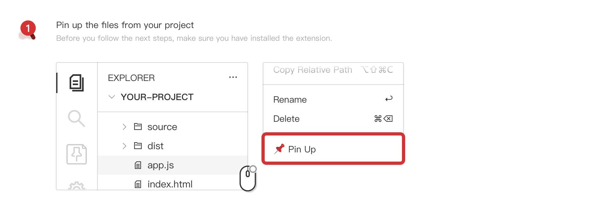
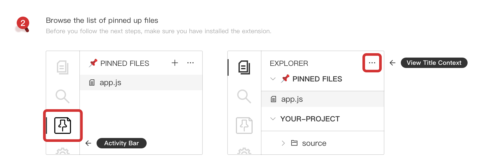

<h1 align="center">
   
    
   
   
  📌 Pin Up
   
   
</h1>

<h4 align="center">An VSCode extension that allows you to 
pin up some frequently opened files</h4>

## Basic Usage

> There are some description images under this section that may be slow to loaded.

First, right click the files in the `Explorer` of the VSCode, then click the `📌 Pin Up` in the popped up context menu.

Second, find the pinned files in the `Activity Bar View` or `Explorer View`. If you can not see a view with the title of `📌 PINNED FILES`, right click the `Activity Bar` or `Explorer View Title Context` and check the `📌 PINNED FILES`.

